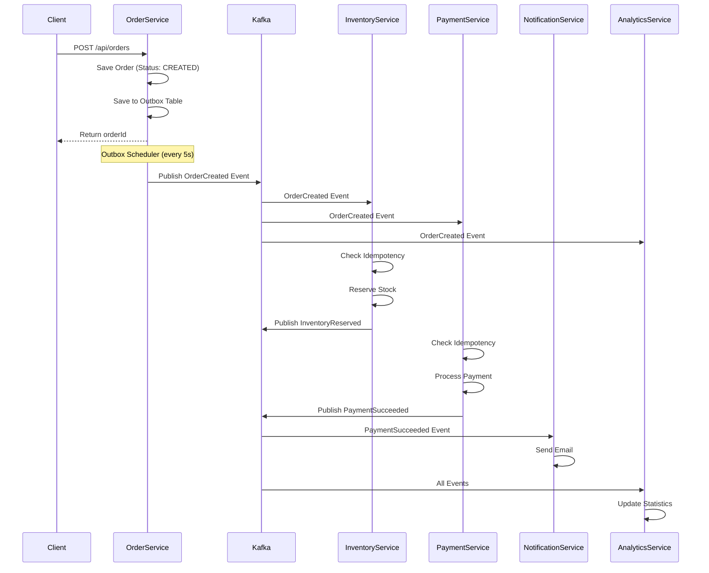
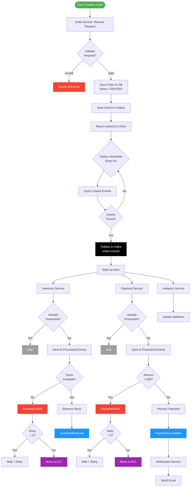

# 🚀 Event-Driven Order Processing System

<div align="center">

**A production-grade microservices system demonstrating event-driven architecture with Apache Kafka**

[](https://openjdk.java.net/)
[](https://spring.io/projects/spring-boot)
[](https://nextjs.org/)
[](https://www.typescriptlang.org/)
[](https://kafka.apache.org/)

[Features](#-features) • [Architecture](#-architecture) • [Getting Started](#-getting-started) • [Testing](#-testing) • [Troubleshooting](#-troubleshooting)

</div>

---

## 📖 What is This?

This is a **comprehensive microservices ecosystem** that demonstrates how to build scalable, resilient, event-driven systems using modern technologies. The project implements a real-world order processing workflow where multiple services coordinate through **Apache Kafka** to handle distributed transactions.

---
# 🛠️ A-Z Operations Guide

This section covers the essential commands to manage the EventFlow ecosystem.

### 1. Initial Setup & Launch
To start the entire system for the first time:
```bash
docker compose up -d
```

### 2. Creating the Admin User (Required)
If you are starting with a fresh database, run this script to create the SuperAdmin account:
```bash
./setup_admin.sh
```
*Credentials: admin@admin.com / password123*

### 3. Rebuilding Services
If you modify a service (e.g., `frontend` or `order-service`):
```bash
docker compose build [service-name]
docker compose up -d [service-name]
```

### 4. Full Reset
To wipe everything and rebuild from scratch:
```bash
docker compose down
docker compose build --no-cache
docker compose up -d
```

---
### Key Highlights

- ✅ **Saga Choreography Pattern** for distributed transaction management
- ✅ **Transactional Outbox** for guaranteed message delivery
- ✅ **Idempotency** to handle duplicate messages
- ✅ **Dead Letter Queues (DLQ)** for failure handling
- ✅ **Real-time Dashboard** built with Next.js and TypeScript
- ✅ **Integration Tests** using Testcontainers
- ✅ **CI/CD Pipeline** with GitHub Actions
- ✅ **Docker Compose** for one-command deployment

---

## 🏗️ Architecture

The system consists of **5 microservices** communicating asynchronously through **Apache Kafka**. Each service is independently deployable and scalable.

### Service Communication Flow

```mermaid
graph LR
    Client[👤 Client/Dashboard<br/>Port 3000]
    
    Client -->|"1️⃣ POST /api/orders<br/>{customerId, amount}"| OS[Order Service<br/>Port 8081]
    
    OS -->|"2️⃣ Save Order"| DB_OS[(💾 PostgreSQL<br/>order_db)]
    OS -->|"3️⃣ Save to Outbox"| DB_OS
    
    OS -.->|"4️⃣ Scheduler polls<br/>every 5 seconds"| OUTBOX[⏰ Outbox Publisher]
    
    OUTBOX -->|"5️⃣ Publish OrderCreated"| KAFKA[Apache Kafka<br/>orders.events]
    
    KAFKA -->|"6️⃣ Consume OrderCreated"| IS[Inventory Service<br/>Port 8082]
    KAFKA -->|"6️⃣ Consume OrderCreated"| PS[Payment Service<br/>Port 8083]
    KAFKA -->|"6️⃣ Consume OrderCreated"| AS[Analytics Service<br/>Port 8085]
    
    IS -->|"7️⃣ Reserve Stock"| DB_IS[(💾 PostgreSQL<br/>inventory_db)]
    IS -->|"8️⃣ Publish InventoryReserved"| KAFKA_INV[Kafka<br/>inventory.events]
    
    PS -->|"7️⃣ Process Payment"| DB_PS[(💾 PostgreSQL<br/>payment_db)]
    PS -->|"8️⃣ Publish PaymentSucceeded"| KAFKA_PAY[Kafka<br/>payment.events]
    
    KAFKA_PAY -->|"9️⃣ Consume PaymentSucceeded"| NS[Notification Service<br/>Port 8084]
    NS -->|"🔟 Send Email"| EMAIL[📧 Email Log]
    
    AS -->|"Real-time Stats"| DB_AS[(💾 PostgreSQL<br/>analytics_db)]
    
    Client -.->|"Monitor: GET /orders"| OS
    Client -.->|"Monitor: GET /analytics/stats"| AS
    Client -.->|"Health Checks"| OS
    Client -.->|"Health Checks"| IS
    Client -.->|"Health Checks"| PS
    Client -.->|"Health Checks"| NS
    Client -.->|"Health Checks"| AS
    
    style Client fill:#4CAF50,stroke:#2E7D32,stroke-width:3px,color:#fff
    style OS fill:#2196F3,stroke:#1565C0,stroke-width:3px,color:#fff
    style IS fill:#2196F3,stroke:#1565C0,stroke-width:3px,color:#fff
    style PS fill:#2196F3,stroke:#1565C0,stroke-width:3px,color:#fff
    style NS fill:#2196F3,stroke:#1565C0,stroke-width:3px,color:#fff
    style AS fill:#2196F3,stroke:#1565C0,stroke-width:3px,color:#fff
    style KAFKA fill:#000,stroke:#FF6B6B,stroke-width:4px,color:#fff
    style KAFKA_INV fill:#000,stroke:#FF6B6B,stroke-width:4px,color:#fff
    style KAFKA_PAY fill:#000,stroke:#FF6B6B,stroke-width:4px,color:#fff
    style OUTBOX fill:#FFA726,stroke:#E65100,stroke-width:3px,color:#fff
    style DB_OS fill:#455A64,stroke:#263238,stroke-width:2px,color:#fff
    style DB_IS fill:#455A64,stroke:#263238,stroke-width:2px,color:#fff
    style DB_PS fill:#455A64,stroke:#263238,stroke-width:2px,color:#fff
    style DB_AS fill:#455A64,stroke:#263238,stroke-width:2px,color:#fff
    style EMAIL fill:#9C27B0,stroke:#6A1B9A,stroke-width:2px,color:#fff
```



**Legend:**
- 🟢 **Green** = Client/UI
- 🔵 **Blue** = Microservices
- ⚫ **Black** = Kafka Topics
- 🟠 **Orange** = Schedulers
- ⚪ **Gray** = Databases
- 🟣 **Purple** = External Systems
- **Solid lines** (→) = Direct API calls or event publishing
- **Dotted lines** (···→) = Polling or monitoring

### Kafka Event Flow (Saga Choreography)



### Internal Process Flow (Order Lifecycle)


<details>
<summary>View as Mermaid Diagram (Click to expand)</summary>



</details>

---

## 🎯 Features

### 🔄 Distributed Transaction Patterns

| Pattern | Description | Implementation |
|---------|-------------|----------------|
| **Transactional Outbox** | Guarantees at-least-once delivery by saving events in the same DB transaction | `OutboxEntity` + `OutboxPublisherScheduler` |
| **Saga Choreography** | Services react to events independently without central orchestration | Kafka consumers in each service |
| **Idempotency** | Prevents duplicate processing using `processed_events` table | `ProcessedEvent` entity |
| **DLQ** | Failed messages are routed to Dead Letter Topics for manual intervention | Kafka retry + `.DLT` topics |

### 🎨 Modern Frontend

- **Framework**: Next.js 14 with App Router
- **Language**: TypeScript for type safety
- **UI Library**: shadcn/ui with TailwindCSS
- **Data Fetching**: SWR for automatic polling and caching
- **Features**: Order creation, real-time analytics, service health monitoring

### 🧪 Testing

- **Integration Tests**: Testcontainers for testing with real PostgreSQL and Kafka
- **CI/CD**: GitHub Actions workflow for automated builds and tests

---

## 🚀 Getting Started

### Prerequisites

- Docker & Docker Compose
- Java 21 (for local development)
- Node.js 20 (for frontend development)

### One-Command Deployment

```bash
docker compose up -d
```

This starts:
- ✅ Kafka & Zookeeper
- ✅ PostgreSQL (5 databases)
- ✅ 5 Backend Microservices
- ✅ Next.js Frontend Dashboard
- ✅ Kafka-UI for monitoring

### Access Points

| Service | URL | Description |
|---------|-----|-------------|
| **Frontend Dashboard** | http://localhost:3000 | Modern React UI for order management |
| **Kafka UI** | http://localhost:8080 | Monitor Kafka topics and messages |
| **Order Service** | http://localhost:8081 | Create and query orders |
| **Analytics API** | http://localhost:8085/api/analytics/stats | View event statistics |

---

## 🧪 Testing

### Integration Tests

Run backend tests with Testcontainers:

```bash
cd backend
mvn test
```

This will:
1. Spin up PostgreSQL and Kafka containers
2. Run the OrderService integration test
3. Verify the complete Saga flow

### Manual Testing

Create an order via cURL:

```bash
curl -X POST http://localhost:8081/api/orders \
  -H "Content-Type: application/json" \
  -H "X-API-KEY: secret-api-key" \
  -d '{
    "customerId": "CUST-123",
    "totalAmount": 150.0,
    "currency": "USD",
    "items": [{"productId": "PROD-A", "quantity": 1}]
  }'
```

---

## 🔍 Project Structure

```
kafka/
├── backend/                    # Java microservices
│   ├── common/                # Shared event schemas and utilities
│   ├── order-service/         # Order creation and orchestration
│   ├── inventory-service/     # Stock reservation
│   ├── payment-service/       # Payment processing
│   ├── notification-service/  # Email notifications
│   ├── analytics-service/     # Event statistics
│   └── pom.xml               # Parent POM
├── frontend/                  # Next.js dashboard
│   ├── app/                  # Next.js App Router
│   ├── components/           # React components (shadcn/ui)
│   ├── lib/                  # API client and utilities
│   └── Dockerfile
├── docker-compose.yml         # Orchestration
├── .github/workflows/         # CI/CD pipelines
└── README.md
```

---

## ⚠️ Troubleshooting

### Common Issues & Solutions

| Issue | Cause | Solution |
|-------|-------|----------|
| **Port 5432 already in use** | Local PostgreSQL running | Changed external port to 5433 |
| **Analytics Service shows DOWN** | Missing Actuator dependency | Added `spring-boot-starter-actuator` |
| **CORS errors in dashboard** | Browser security restrictions | Configured `@CrossOrigin` and Actuator CORS |
| **Services start before Kafka** | Race condition | Added `healthcheck` and `depends_on` conditions |

### Viewing Logs

```bash
# All services
docker compose logs -f
+
+# Specific service
+docker compose logs -f order-service
+
+# Container-level
+docker logs -f kafka-order-service-1
+```
+
+---
+
+## 🛠️ Tech Stack
+
+### Backend
+- **Java 21** with Records
+- **Spring Boot 3.2.2**
+- **Spring Kafka** for event streaming
+- **Spring Data JPA** with PostgreSQL
+- **Testcontainers** for integration testing
+- **Spring Boot Actuator** for health checks
+
+### Frontend
+- **Next.js 14** with App Router
+- **TypeScript** for type safety
+- **TailwindCSS** for styling
+- **shadcn/ui** for components
+- **SWR** for data fetching
+
+### Infrastructure
+- **Apache Kafka 7.5.0**
+- **PostgreSQL 15**
+- **Docker & Docker Compose**
+- **GitHub Actions** for CI/CD
+
+---
+
+## 📚 Learn More
+
+- [Saga Pattern](https://microservices.io/patterns/data/saga.html)
+- [Transactional Outbox](https://microservices.io/patterns/data/transactional-outbox.html)
+- [Event-Driven Architecture](https://martinfowler.com/articles/201701-event-driven.html)
+
+---
+
+<div align="center">
+
+**Built with ❤️ using Spring Boot, Kafka, and Next.js**
+
+*Developed by David Alrefai*
+
+</div>
+

```
curl -X POST http://localhost:8000/auth/promote \
  -H "Content-Type: application/json" \
  -d '{
    "username": "admin",
    "secretKey": "admin_secret_key_change_me"
  }'
```